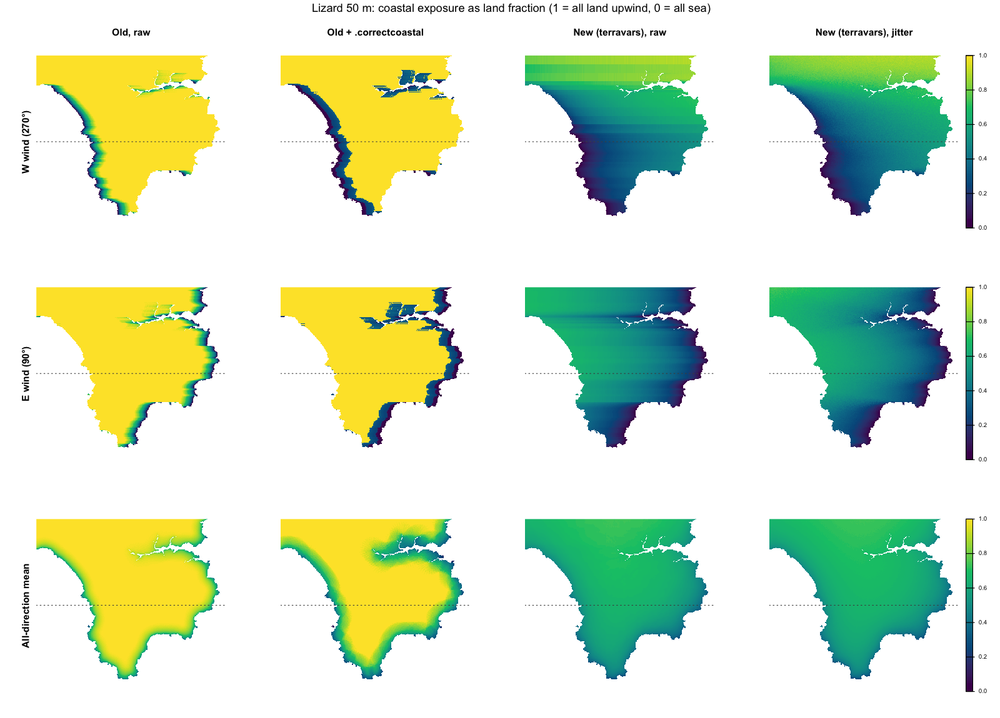
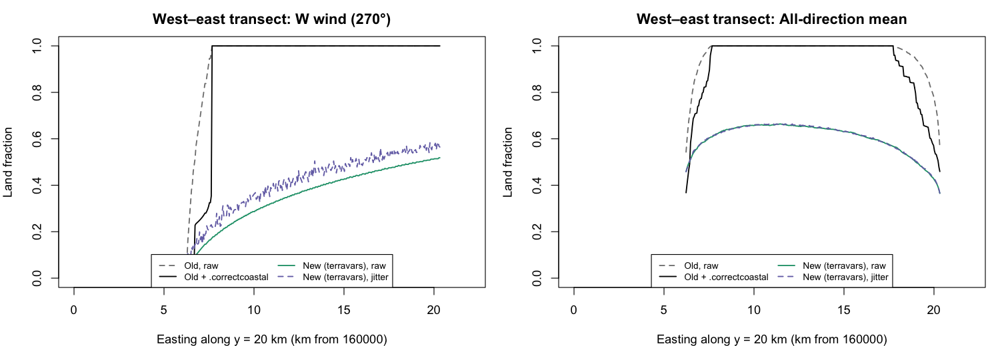
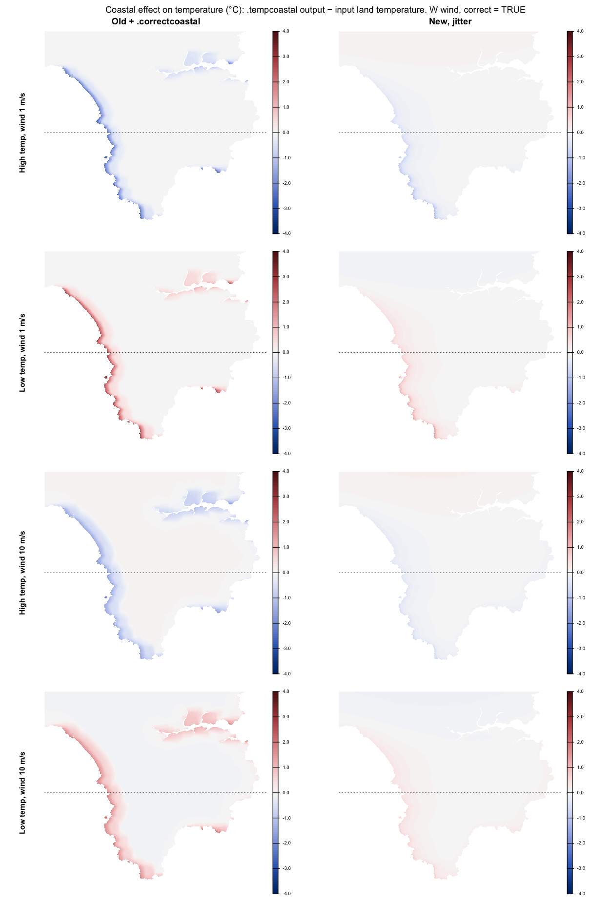
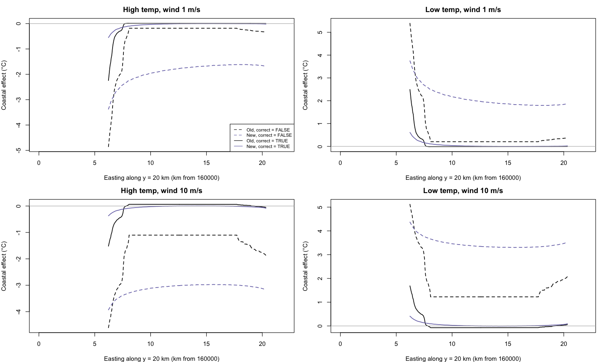

# Coastal temperature effect in mesoclim

How the coastal effect on downscaled temperature is calculated (as of `main` @ `208a427`), known issues, and ways to make it faster.

## Call chain

```
spatialdownscale(coastal = TRUE)
├─ winddownscale(...)                       → uzf: fine-resolution wind speed
└─ tempdaily_downscale(...)   [daily data]      or   temphrly_downscale(...)  [hourly]
   ├─ SST preparation (once per call)
   │    .spatinterp(sst)          fill NA sea cells
   │    .tmeinterp(sst, NA, tme)  interpolate monthly SST to each timestep
   │    project() + .resample(method = "cubic")  → sstf on the dtmf grid
   └─ .tempcoastal(tc, sstf, u2 = uzf, wdir = coarse winddir, dtmf, dtmm, dtmc)
        called 3× for daily data (tminf, tmaxf, tmeanf), 1× for hourly
        ├─ .resample(dtmm, dtmf, msk = TRUE) → landsea mask (1 = land, NA = sea)
        ├─ for 32 wind directions (every 11.25°):
        │     coastalexposure(landsea, ext(dtmf), dir)
        │        └─ invls_calc(...)   [C++, src/mesoclimCpp.cpp]
        │     .correctcoastal(r)     resolution correction
        └─ smoothing, wind lookup, weighting and blending (steps 4–7)
```

Upstream, `create_ukcpsst_data()` calls `.sea_to_coast()` to extend SST into coastal cells.

## Method

1. **Land/sea mask.** `dtmm` is resampled onto `dtmf`'s grid and masked by `dtmf`, then converted to 1 for land and NA for sea. `coastalexposure()` turns it into 1 = land, 0 = sea.
2. **Upwind land fraction, per cell and direction** (`coastalexposure()` → `invls_calc()`).
   - Sample distances are `s = c(0, (8:1000)/8)^2 × resolution`, so the spacing between samples grows with distance. They're cut off at `maxdist = sqrt(xres·width + yres·height)`.
   - For each land cell, the land/sea value is read at each distance along the upwind direction. The focal cell counts as land.
   - Samples outside the landsea raster are dropped, so they're treated as unknown rather than sea.
   - The result is the mean of the samples, from 0 (sea upwind) to 1 (all land).
3. **Resolution correction** (`.correctcoastal()`). The land fraction is converted to its logit (log-odds), rescaled with coefficients that depend on `log(resolution)` (separately above and below 0.5), and converted back.
4. **Smoothing** (`.tempcoastal()`).
   - `lsr2` (directional exposure): each direction is blended with its two neighbours (weights 0.25 / 0.5 / 0.25), then spatially smoothed with a 5 × 5 focal mean.
   - `lsm` (all-direction exposure): the mean of the 32 unsmoothed directions.
   - If no cell has `lsm < 1` (no coast), temperature is returned unchanged.
5. **Wind direction per timestep.** Taken from the coarse grid at the centre of its extent, falling back to the median if that's NA. One direction is used for the whole area at each timestep, and it selects the matching `lsr2` layer.
6. **Sea weighting.**
   ```
   p2    = 0.10420·√u2 − 0.47852                    wind-speed dependence
   lswgt = −0.1096 + p2·(logit(lsr) + 3.4012) − 0.1553·logit(lsm)
   swgt  = 1 / (1 + exp(−lswgt))                     sea-influence weight (0–1)
   tcp   = swgt·sstf + (1 − swgt)·tc                 blend towards SST
   ```
7. **Mean-preserving correction** (`correct = TRUE`). `tcp` is aggregated to the coarse resolution and resampled back (`tcc`). The result is `tc + (tcp − tcc)·swgt`, so the effect redistributes temperature within each coarse cell rather than shifting its mean.

## Known issues

1. **Search distance formula.** `sqrt(xres·width + yres·height)` mixes units. For the Lizard at 50 m it gives about 1.4 km, and it varies with the extent passed in, so tiles disagree with each other and with an untiled run. The Euclidean diagonal would be about 30 km. This is a likely cause of the tiling lines.
2. **Wider `dtmm` never used.** Resampling `dtmm` onto `dtmf`'s grid crops it to `dtmf`'s extent. The `.tempcoastal()` docs say `dtmm` should match `dtmf`'s resolution but cover a wider area. `spatialdownscale()` documents it as medium resolution, and the vignettes pass 1 km `dtmm` with 50 m `dtmf`.
3. **Weighting not as documented.** `coastalexposure()` is documented as inverse-distance-squared weighting. It's actually a plain mean of samples whose spacing grows with distance, which weights distance roughly by 1/√d.
4. **One wind direction for the whole area** at each timestep, which matters for large tiled domains.
5. **Fragile argument matching.** Callers pass `sst = sstf` to a parameter named `sstf`, which only works through R's partial argument matching.
6. **Tile merge.** `spatialdownscale_tiles()` merges tiles with `merge()`, which keeps the first tile's values in overlaps. Each tile's edge values are used instead of the neighbour's interior values.

## Speed

Profile of vignette 2's tiled example (Lizard, 50 m, 4 tiles, one month): 161 s total. `swdownscale()` takes 49%, `.tempcoastal()`/`coastalexposure()` 32%, and array ↔ SpatRaster conversions 15%. Computing coastal exposure takes about 18 s for the whole Lizard and about 7 s per tile, and it's repeated 3 times per tile per month for daily data.

### Coastal effect

1. **Precompute the static exposure once.** Steps 1–4 depend only on geography. Compute `lsr2` (32 layers) and `lsm` once for the whole domain, then pass them (or tile crops of them) to `.tempcoastal()`. Only steps 5–7 depend on time. This removes 96 `invls_calc()` passes per tile-month for daily data, about 30% of run time for one month and most of the coastal cost for longer runs. It doesn't change any results.
2. **Share it across tmin, tmax and tmean** within `tempdaily_downscale()`, even without tiling: 3× less coastal work per call.
3. **Precompute on the full `dtmm` with a fixed search distance.** Fixing issues 1 and 2 at the same time makes tiled and untiled results consistent.
4. **Optimise `invls_calc()`.** It allocates new sample vectors (`xdist`, `ydist`, `xy`, `lsc`) for every cell. The offsets could be computed once per direction, and the land/sea values read directly by index.

### Tiled downscaling generally

5. **Shortwave: solar geometry per hour, not per cell.** Zenith angle varies by less than 0.1° across a 10 km tile, yet sun angle, clear-sky radiation and diffuse fraction are calculated for every one of about 30 million cell-hours per tile-month (about 5 s of C++). Night-time hours could be skipped, and the sky-view already passed in could be used rather than recomputed.
6. **Run tiles in parallel** with `parallel::mclapply` or `future.apply`, passing SpatRasters via `wrap()`. The limit is memory, at a few hundred MB of hourly arrays per worker.
7. **Loop tiles outside and months inside,** so each tile's fixed inputs (crops of `dtmf`, basins, wind coefficients, sky-view, horizon and coastal exposure) are prepared once.
8. **Crop `climdata`, `sst` and `dtmm` to each tile plus a buffer** of a couple of coarse cells. This matters for large domains.
9. **Reduce array ↔ SpatRaster conversions** (15% of run time), and drop the `print()` for every tile.

## Comparison with microclima and terravars

Sources:
- `ilyamaclean/microclima` (master @ `7fa7fd7`, 5 Sept 2024): `R/othertools.R` (`invls()`, `coastalTps()`), `R/datatools.R` (`.invls.auto()`, `coastalNCEP()`), `src/invls.cpp` (`invls_calc()`).
- `ilyamaclean/terravars` (main @ `68d99cf`, 8 Aug 2026): `R/wind.R` (`coastalexposure()`), `src/wind.cpp` (`coastal_exposure_cpp()`). terravars calculates exposure only; it has no temperature model.

### Same in all three

- **Sampling algorithm.** For each land cell, land/sea is sampled at distances along the upwind line and averaged. The focal cell counts as land, and samples outside the available data are skipped rather than counted as sea. terravars' `coastal_exposure_cpp()` is described in its source as a port of `invls_calc()`.
- **Distance weighting comes only from sample spacing** (`s = k^n × resolution`, n = 2 by default). There's no explicit distance weight. terravars documents this accurately; microclima and mesoclim describe it as "inverse distance squared".
- **Wind direction:** a single direction per calculation.

microclima and mesoclim share identical `invls_calc()` C++ and `invls()` ≡ `coastalexposure()` R code, including the `maxdist` formula. The search-distance issue is inherited from microclima.

### Different

| | microclima (`coastalNCEP` → `.invls.auto`) | mesoclim (`.tempcoastal`) | terravars (`coastalexposure`) |
|---|---|---|---|
| **Land/sea extent** | `invls()` docs require `landsea` to have a *larger* extent than the target, because upwind land/sea outside the area must be seen. | `dtmm` is resampled onto `dtmf`'s grid, which crops it to the target extent. Nothing upwind outside `dtmf` is seen. | Output covers the whole `landsea` (no target-extent argument). The docs advise supplying `landsea`/`coarse` well beyond the region of interest and cropping afterwards. |
| **Search distance (`maxdist`)** | `sqrt(xres·width + yres·height)` per resolution level, which is small, but offset by the multi-resolution design (next row). | `sqrt(xres·width + yres·height)`: about 1.4 km for the Lizard at 50 m, and it varies with the extent passed in. | **True diagonal** `sqrt(width² + height²)` of the largest level. Source comments explicitly flag the old formula as a bug (e.g. 2 km instead of about 28 km for a 22 × 18 km raster). The number of samples (`kmax`) is derived from `maxdist` rather than capped at k = 125. |
| **Multi-resolution** | DEMs downloaded at 10 km, 1 km, 500 m, 90 m, 30 m and the target resolution over progressively smaller areas (the coarsest covers about 5.6°). `invls()` runs separately at each level, each result is rescaled by the fraction of sample distances it covers (`adjust.lsr`), and the cell-wise **minimum** (most sea-exposed) is taken. | None. | Optional `coarse` list of land/sea masks. Within **one** search, each sample point is read from the **finest level that covers it**, and coarser levels are used only in the far field. No separate runs and no rescaling. |
| **DEM / mask source** | Downloaded automatically (`get_dem()`). | User-supplied `dtmm`. mesoclim's `get_dem()` (and `curl`/`elevatr`) appears to be a leftover of the microclima approach. | User-supplied `landsea` and `coarse`. The bundled `dtmc` dataset can serve as `coarse`. A separate `dem_download()` exists. |
| **Sample spacing** | Fixed n = 2. | Fixed n = 2. | Tunable `n` (default 2). With `n < 2`, the search is capped at 2× `landsea`'s diagonal, with a warning. |
| **Directions** | 8 (45°) by default (`steps`). | 32 (11.25°), fixed (`ndir`). | One direction per call, or `wdir = "all"` for the mean of 8 (45°). |
| **Angular jitter** | None. | None. | Optional `jitter` (±10°, deterministic hash per cell and sample) to smooth grid-alignment artifacts. |
| **Direction smoothing** | 0.25 / 0.5 / 0.25 neighbour blend. | 0.25 / 0.5 / 0.25 neighbour blend. | None (left to the caller). |
| **Spatial smoothing** | None. | 5 × 5 focal mean on the directional exposure. | None. |
| **Resolution / scale adjustment** | Each direction is divided by the NCEP grid cell's mean exposure relative to its centre (`cncep`). | `.correctcoastal()`: a logit correction depending on `log(resolution)`. Coarse-cell means are preserved later, on temperature (`correct = TRUE`). | None. |
| **Output convention** | Land fraction (1 = all land upwind). | Land fraction (1 = all land upwind). | **Sea fraction** (1 = fully exposed to sea), i.e. `1 − land fraction`. |
| **Performance** | Serial C++ that allocates vectors per cell. Computed **once for the whole area** (`lsa.array`); only arithmetic runs per timestep. | Serial C++ that allocates vectors per cell. Recomputed for all 32 directions in every `.tempcoastal()` call: 3× per daily run, for every tile and month. | **OpenMP-parallel** C++ with no allocation inside the loop (direction sin/cos computed once). Called once per direction by the user. |
| **Projection** | Any. | Any. | Requires a projected CRS (`.check_projected()`). |
| **Temperature model** | Additive adjustment to the land–sea contrast: `dT = SST − T`; `d1 = bound((3 − lsr_upwind)/3, 0.1, 1)`, `d2` likewise from `lsrm`; `xx = p1·d1^b1 + p2·d2^b2` (clamped ±6 °C), with `p1, p2, b1, b2` linear in `dT` and `log(windspeed)`; `T = SST − (dT + xx)`. | Logistic sea weight: `swgt = logistic(−0.1096 + p2·(logit(lsr) + 3.4012) − 0.1553·logit(lsm))` with `p2 = 0.1042·√u2 − 0.4785`; `T = swgt·SST + (1 − swgt)·T`; then the coarse-cell mean-preserving correction. The weight doesn't depend on `dT`. | None (exposure only). |
| **Inputs to temperature model** | Point time series: one NCEP temperature, wind speed and direction, and one NOAA ERSST SST series. | Gridded: fine-resolution `tc`, spatial SST `sstf` resampled to `dtmf`, and fine-resolution wind speed `uzf`. Wind direction is a single value. | — |
| **Alternative method** | `coastalTps()`: thin-plate spline of the coarse `dT` with upwind and all-direction exposure as covariates. | None. | — |

### Implications for mesoclim

1. **Exposure is short-sighted, and terravars already contains the fix.** mesoclim inherited microclima's single-resolution `invls()` without its multi-resolution wrapper or wider land/sea extent, so it only looks about 1–2 km upwind. terravars' `coastalexposure()` fixes the `maxdist` formula, removes the k = 125 cap, and handles multi-resolution in one search via `coarse`. Replacing mesoclim's `coastalexposure()`/`invls_calc()` with the terravars implementation, with `dtmm` (unresampled, wider extent) as a `coarse` level, would address issues 1 and 2 above and make tiles consistent.
2. **Speed.** Adopting the terravars C++ (parallel, no allocation per cell) and microclima's precompute-once pattern together gives the main coastal speed-up. Exposure would be computed once per domain per direction, with only per-timestep arithmetic in `.tempcoastal()`.
3. **Convention and calibration.** terravars returns sea fraction (`1 − land fraction`), so mesoclim's logit terms would need `1 − x` or refitting. More importantly, correcting the search distance changes exposure values substantially, and mesoclim's logistic coefficients (and `.correctcoastal()`) were fitted to the short-range values. They'll need recalibrating against observations after the change.
4. **Options worth carrying over:** `jitter` (reduces grid-direction artifacts) and the tunable `n`. Keep mesoclim's direction smoothing and 32 directions unless recalibration suggests otherwise.

## Sample outputs: old vs new exposure on the Lizard

Lizard at 50 m (`lizard50m`), with `dtmm` as the terravars `coarse` level. All values are land fraction (1 = all land upwind, 0 = all sea); terravars output was converted with `1 − x`. "Jitter" is terravars' `jitter = TRUE` (each sample's azimuth perturbed by up to ±10°).





| | Old raw | Old + `.correctcoastal()` | New raw | New, jitter |
|---|---|---|---|---|
| W wind: mean (5–95%) | 0.96 (0.62–1.00) | 0.89 (0.24–1.00) | 0.53 (0.15–0.85) | 0.54 (0.17–0.86) |
| E wind: mean (5–95%) | 0.95 (0.57–1.00) | 0.88 (0.23–1.00) | 0.44 (0.13–0.65) | 0.45 (0.13–0.67) |
| W wind: cells exactly 1 | 86% | 86% | 0% | 0% |
| All-direction mean | 0.95 | 0.89 | 0.62 | 0.62 |

- **Old raw:** exposure only falls below 1 in a band about 1.4 km wide along the upwind coast; the interior is exactly 1.
- **New raw:** a smooth gradient across the peninsula. It shows horizontal stripes about 1 km apart under W/E winds, where far-field samples run along grid rows through the 1 km `dtmm` cells.
- **New, jitter:** the stripes disappear and means are unchanged. Jitter adds fine cell-to-cell speckle (about ±0.03 along the W-wind transect), which the planned 5 × 5 spatial smoothing would remove. The all-direction mean is almost identical with and without jitter, because averaging across directions already cancels most striping.
- **`.correctcoastal()` is discontinuous.** The branches below and above 0.5 don't meet, and exactly 1 passes through unchanged while values just below 1 are pulled far down:

| Input | 0.49 | 0.50 | 0.501 | 0.99 | 0.999 | 1.00 |
|---|---|---|---|---|---|---|
| Output at 50 m | 0.073 | 0.075 | 0.226 | 0.394 | 0.494 | 1.000 |
| Output at 100 m | 0.142 | 0.146 | 0.290 | 0.593 | 0.735 | 1.000 |
| Output at 1 km | 0.660 | 0.674 | 0.554 | 0.999 | 1.000 | 1.000 |

  At 1 km the mapping isn't monotonic. This causes the hard edges in the old-method maps, and applied to terravars exposure it would push most values below 0.3. It shouldn't be carried over as is (plan question 5). Recalibration should use raw terravars exposure, with jitter plus the spatial smoothing.

## Sample outputs: effect on temperature in `.tempcoastal()`

The two exposures (old + `.correctcoastal()`, and new terravars with jitter) were run through identical code: a copy of `.tempcoastal()` from the exposure step onwards, checked to reproduce `.tempcoastal()` exactly with the old exposure. Setup: Lizard at 50 m, westerly wind, uniform land temperature and SST, so any spatial pattern is the coastal effect alone. The effect is the output minus the input land temperature.

- **High temperature:** land 22 °C, SST 13 °C (sea cooler).
- **Low temperature:** land 0 °C, SST 10 °C (sea warmer).
- **Wind:** 1 and 10 m/s.





| Scenario | Wind | Exposure | Sea weight: mean (p95) | Effect, `correct = FALSE`: mean (5–95%) °C | Effect, `correct = TRUE`: mean (5–95%) °C | Cells \|effect\| > 0.5 °C (TRUE) |
|---|---|---|---|---|---|---|
| High temp | 1 m/s | Old | 0.06 (0.27) | −0.55 (−2.40 to −0.18) | −0.08 (−0.47 to 0.01) | 4.6% |
| High temp | 1 m/s | New | 0.19 (0.30) | −1.67 (−2.69 to −1.00) | −0.02 (−0.20 to 0.06) | 1.0% |
| High temp | 10 m/s | Old | 0.17 (0.38) | −1.57 (−3.43 to −1.10) | −0.07 (−0.69 to 0.08) | 9.1% |
| High temp | 10 m/s | New | 0.33 (0.40) | −2.95 (−3.58 to −2.46) | −0.01 (−0.17 to 0.11) | 0.1% |
| Low temp | 1 m/s | Old | 0.06 (0.27) | 0.61 (0.20 to 2.66) | 0.08 (−0.01 to 0.53) | 5.5% |
| Low temp | 1 m/s | New | 0.19 (0.30) | 1.85 (1.11 to 2.99) | 0.02 (−0.07 to 0.22) | 1.2% |
| Low temp | 10 m/s | Old | 0.17 (0.38) | 1.74 (1.22 to 3.81) | 0.07 (−0.09 to 0.77) | 10.3% |
| Low temp | 10 m/s | New | 0.33 (0.40) | 3.28 (2.73 to 3.98) | 0.01 (−0.12 to 0.19) | 0.3% |

- **Before the mean-preserving correction (`correct = FALSE`):**
  - The old exposure gives a strong effect in the narrow coastal band (up to about ±5 °C at the coast) and a small uniform effect inland.
  - The new exposure gives a smooth effect that declines inland but stays large everywhere (−1.6 to −3 °C inland in the high-temperature cases). With the current coefficients, the whole Lizard is treated as strongly sea-influenced.
  - Higher wind speed raises the sea weight under both methods (the `p2` term).
- **After the correction (`correct = TRUE`, the default):** the effect nearly vanishes with the new exposure (within ±0.2 °C for 95% of cells). The old exposure keeps a coastal band of up to about ±2.5 °C. The correction subtracts the coarse-block mean effect, so a smoothly varying exposure leaves little within-block contrast.
- **Temperature dependence:** the effect is simply proportional to (SST − land temperature). High and low temperature cases are mirror images, because the weights don't depend on the land–sea temperature difference or on stability. microclima's model does depend on the temperature difference.

Further issues found in `.tempcoastal()`:
1. **Correction is second order in the sea weight.** The correction computes `tc + (tcp − tcc)·swgt`, where `tcp − tc = swgt·(SST − tc)` already. So the retained effect is roughly `swgt·(swgt·ΔT − block mean of swgt·ΔT)`: second order in `swgt`, which is why corrected effects are small. Check whether this is intended (the code comments it as the "new version").
2. **Correction blocks aren't the climate-model cells.** `aggregate(tcp, af)` builds 12 km blocks from `dtmf`'s own origin, so they don't line up with the `dtmc` cells whose means should be preserved. In tiled runs, each tile would also use different blocks.
3. **Sea weight never reaches 0 inland,** even with the old exposure. `lsr == 1` is replaced by the largest value below 1 before taking logits, which caps the weight: about 0.02 at 1 m/s and 0.12 at 10 m/s for the old method.
4. **Fails with a single timestep.** Selecting one wind-direction layer drops the array to 2-D, and `.rta(…, dim(lsr)[3])` fails ("invalid 'times' argument").

## Implementation plan: terravars exposure with precomputation

Goal: replace mesoclim's coastal exposure calculation with the terravars method, compute the static exposure **once per domain**, and pass it to every function that applies the coastal effect.

### Status (30 Sept 2026)

Phases 1–3 are implemented on branch `coastal-terravars`, with tests and a vignette 2 update. Decisions taken: port the code (no licence issue, same author); `coastalexposure()` returns **land fraction**; `jitter = TRUE` by default; `.correctcoastal()` dropped; `.tempcoastal()` defaults to `correct = FALSE`. Replaced code is archived in `R_new/coastal_legacy/` (not on GitHub).

- **API:**
  - `coastalexposure(landsea, wdir, coarse = NULL, n = 2, jitter = TRUE)`. A `coarse` level in a differently described CRS is projected to `landsea`'s.
  - `calculate_coastalexposure(dtmf, dtmm, coarse, ndir = 32, smooth = 5, n, jitter, filename)`.
  - A `cex` argument (last position) on `spatialdownscale()`, `spatialdownscale_tiles()`, `tempdaily_downscale()` and `temphrly_downscale()`.
  - `.tempcoastal()` is internal, and no longer fails with a single timestep.
- **Speed (optimised build, Lizard, 32 directions):** 4.8 s without jitter, 19 s with it. Jitter's per-sample sin/cos is the main cost; a lookup table of offset rotations could cut it. Note that `devtools::load_all()` compiles C++ without optimisation, so timings under `load_all()` are about 3× slower.
- **Tiled Lizard, one month (optimised builds):** 88 s on the branch against 94 s on `main`. For longer runs the saving grows in proportion to the number of months.
- **Results change as expected before recalibration:** tmax on the tiled Lizard is +0.18 °C on average against `main` (5–95%: −0.05 to +0.48). In vignette 2, mean tmin is +0.9 °C and mean tmax −0.5 °C.

Next: Phase 4 recalibration. Merge to `main` when the outputs have been checked.

### Evidence from a prototype run

terravars' `coastal_exposure_cpp()` was compiled standalone and run on the Lizard (`lizard50m`, with `dtmm` as a `coarse` level, 32 directions):

| | Current mesoclim | terravars (landsea only) | terravars + `dtmm` coarse |
|---|---|---|---|
| Time, 32 directions | 16.8 s | 2.5 s | 4.5 s |
| Search distance | ~1.4 km | 29.7 km | 92.2 km |
| Mean land fraction (all directions) | 0.95 | 0.78 | 0.62 |

- The runs were single-threaded: R on this Mac is built without OpenMP. Linux/HPC builds would run in parallel.
- **Tile consistency:** a tile computed with `coarse = list(dtmf, dtmm)` matched the whole-domain result exactly (max |diff| = 0).
- **Values change substantially:** 99% of cells differ by more than 0.1 (5–95% range −0.43 to −0.21). The current method only registers sea within about 1.4 km of the coast. terravars gives a gradient across the whole peninsula.
- **Memory:** the precomputed 32 directions plus the mean take 46 MB for the Lizard (23 MB as float32).

### Phase 0: decisions needed first

See *Questions* below: licence and dependency route, output convention, and the recalibration approach. Phases 1–3 can go ahead once 0.1 and 0.2 are settled. Phase 4 decides whether the new method becomes the default.

### Phase 1: exposure core

1. **Bring in the terravars method.** Either port it or import it (Q1/Q2):
   - Add `src/coastal.cpp` containing `coastal_exposure_cpp()`, with its source recorded.
   - Add `src/Makevars` (and `Makevars.win`) with `$(SHLIB_OPENMP_CXXFLAGS)`, so builds with OpenMP run in parallel and the rest run single-threaded.
2. **Rewrite exported `coastalexposure()`** to the terravars signature: `coastalexposure(landsea, wdir, coarse = NULL, n = 2, jitter = FALSE)`. It returns the whole-`landsea` extent in the convention chosen in Q3. Also:
   - check for a projected CRS;
   - unwrap PackedSpatRasters;
   - sort `coarse` levels finest first.
3. **Remove** the old `invls_calc()` (C++ and export). Per `CLAUDE.md`, there's no deprecation period.
4. **Temporary comparison switch.** During Phase 4 only, keep the old calculation available as an internal `method = "legacy"` option, so old and new can be compared on the same inputs. Remove it once calibration is settled.

### Phase 2: precompute function

5. **New exported function** `calculate_coastalexposure(dtmf, dtmm, coarse = NULL, ndir = 32, smooth = 5, n = 2, jitter = FALSE, filename = "")`, named to match `calculate_windcoeffs()`.
   - `landsea` is `dtmf` (NA = sea).
   - `coarse` is `list(dtmm, ...)`, at native resolution and full extent, **not** resampled to `dtmf`. Users can add wider levels, e.g. UKCP 12 km orography.
   - It runs `coastalexposure()` for each of the `ndir` directions and applies the steps that are currently repeated inside `.tempcoastal()`: the 0.25 / 0.5 / 0.25 direction blend, the `smooth` × `smooth` focal mean, and (per Q5) `.correctcoastal()`.
   - It returns a SpatRaster on the `dtmf` grid with `ndir` directional layers (named by azimuth) plus an `all` layer (the all-direction mean), stored as float32 and written to `filename` for large domains.
6. **Validation helper:** `.check_cex(cex, dtmf)`. It uses `compareGeom()`, checks the layer count is `ndir + 1`, and crops automatically when `cex` covers a larger extent than `dtmf` (the tiled case).

### Phase 3: pass the precomputed exposure through the call chain

7. **`.tempcoastal(tc, sstf, u2, wdir, dtmc, cex, correct = TRUE)`.**
   - Drop the `dtmf`, `dtmm`, `ndir` and `smooth` arguments; `ndir` comes from `nlyr(cex) - 1`.
   - Only the time-dependent steps 5–7 remain: pick the wind-direction layer, calculate the weights, blend, and apply the mean-preserving correction.
   - Fix the `sst`/`sstf` argument name used by callers.
8. **`tempdaily_downscale()` and `temphrly_downscale()`:** add `cex = NA`. If it's NA and `coastal = TRUE`, compute it **once** with `calculate_coastalexposure(dtmf, dtmm)` and reuse it for tmin, tmax and tmean. That alone removes the 3× repetition, even without tiling.
9. **`spatialdownscale()`:** add `cex = NA` next to `wca`, `basins`, `skyview` and `horizon`. Compute it if missing, then pass it down.
10. **`spatialdownscale_tiles()`:** compute `cex` once for the whole `dtmf` before the tile loop (with `wca`, `basins` and `skyview`), then `crop(cex, tile)` for each tile. Tiles then get identical exposure where they overlap.
11. **`dtmm` stays required for wind** (`winddownscale()`, `calculate_windcoeffs()`). For the coastal effect it's only needed when `cex` isn't supplied.

Expected speed-up on the one-month tiled Lizard example: coastal exposure falls from about 48 s (recomputed 3× per tile) to about 5 s (once per domain), cutting total run time from 161 s to roughly 118 s before any other changes. For multi-month runs the saving grows in proportion to the number of months.

### Phase 4: calibration and validation (decides whether the new method becomes the default)

12. **Refit the sea-weighting model.** Refit the logistic coefficients in `.tempcoastal()` (−0.1096, 3.4012, −0.1553, and the `p2` wind term) against observations using the new exposure. Applying the current coefficients to exposure that's about 0.33 lower on average would greatly strengthen the coastal effect inland.
13. **Reassess `.correctcoastal()`.** It compensates for resolution-dependent exposure under the short search distance. With a physical search distance and multi-resolution far field it may be unnecessary, or it may need refitting (Q5).
14. **Choose defaults** for `n`, `jitter`, `ndir` and `smooth`, and for which `coarse` levels to recommend.
15. **Side-by-side validation** (legacy against new) on the vignette domains. A first check can use tmin/tmax against the HadUK 1 km data already in `inst/extdata/haduk` (May 2018, Cornwall). Proper calibration needs station or gridded observations across a range of coastal settings (Q4).

### Phase 5: tests, docs, vignettes

16. **Tests:**
    - synthetic geometries: an island in open sea gives low land fraction; a large landmass interior gives about 1; a single direction behaves as expected;
    - tile consistency (a crop of the domain `cex` equals a per-tile `cex` calculated with the same `coarse`);
    - `.tempcoastal()` gives the same result with supplied `cex` as with `cex` computed internally;
    - error messages for a geographic (unprojected) CRS and mismatched geometry (`expect_snapshot()`).
17. **Docs and vignettes:**
    - vignette 2's "Topographical effects pre-processing" section computes `cex` with the other static inputs and passes it on;
    - update `@param dtmm` everywhere so the documented role is consistent (Q6);
    - update this file and the audit.
18. **Clean-up:** remove the `.tempcoastal` export (audit item 16); update or retire `inst/extdata/data_scripts/testing_coastal_effect.R` and `testing_spdownscale.R`, which use the old functions.

### Questions

1. **Licence.** terravars is GPL (≥ 3); mesoclim is GPL-2 only. Copying GPL-3 code into a GPL-2-only package isn't allowed. As the same author owns both, the options are: relicense mesoclim as GPL (≥ 2) or GPL-3; dual-license the terravars code; or import rather than copy.
2. **Port or import?**
   - Importing terravars keeps one maintained implementation, but adds a GitHub-only dependency at version 0.0.1 whose API may change.
   - Porting (vendoring) the ~150 lines of C++ plus the R wrapper keeps mesoclim self-contained, but the two copies can drift apart.
   - Recommendation: port now, with the source recorded. Revisit importing if terravars goes to CRAN.
3. **Convention.** terravars returns sea fraction (1 = exposed); mesoclim's logit terms use land fraction. Keep land fraction internally (a one-line `1 − x`), or switch to sea fraction throughout and refit to that? Switching matches terravars and the function's name.
4. **Recalibration data and ownership.** What were the current coefficients fitted to, and can that analysis be re-run? Does the new method stay opt-in (`method = "legacy"` as default) until it's recalibrated?
5. **`.correctcoastal()`:** keep, refit or drop? Is its role covered by the mean-preserving `correct = TRUE` step on temperature?
6. **Role of `dtmm`.** The docs contradict each other (medium resolution / wider area vs same resolution as `dtmf`). The new design uses `dtmm` at native resolution as a far-field level. Should the coastal far field instead be a separate `coarse` argument, e.g. allowing a national 12 km mask as well, leaving `dtmm` for wind only? How far should the far field reach? The prototype reached 92 km with `dtmm`; coastal influence on land temperature is probably tens of km.

### Wider issues

- **Inland water:** NA cells in DTMs are treated as sea, so lakes and reservoirs count as sea. Is that wanted, or should a separate water mask distinguish them?
- **Projection:** terravars requires a projected CRS. The UKCP workflows are projected (OSGB), but ERA5-only workflows might pass lon/lat `dtmf`. Add a clear error, or reproject internally?
- **Memory for large domains:** `ndir + 1` layers × cells. Cornwall at 50 m is roughly 2–3 million cells, about 300 MB as float32. Use `filename` to keep it on disk, or reduce `ndir` to 16.
- **Parallelism:** OpenMP inside `coastal_exposure_cpp()` combined with future tile-level parallelism (speed-up item 6) could oversubscribe cores. Set threads explicitly when both are used.
- **Wind direction per cell:** with exposure precomputed per direction, selecting a layer per *cell* becomes cheap. The downscaled wind direction `wdf` from `winddownscale()` could replace the single domain-wide direction (known issue 4), at the cost of another model change to validate.
- **Tile merge** (known issue 6) is separate. Consistent exposure across tiles removes the main source of tile seams, but overlaps should still be cropped to tile cores before `merge()`.
- **Keeping in sync with terravars:** decide who tracks upstream fixes if the code is ported.
